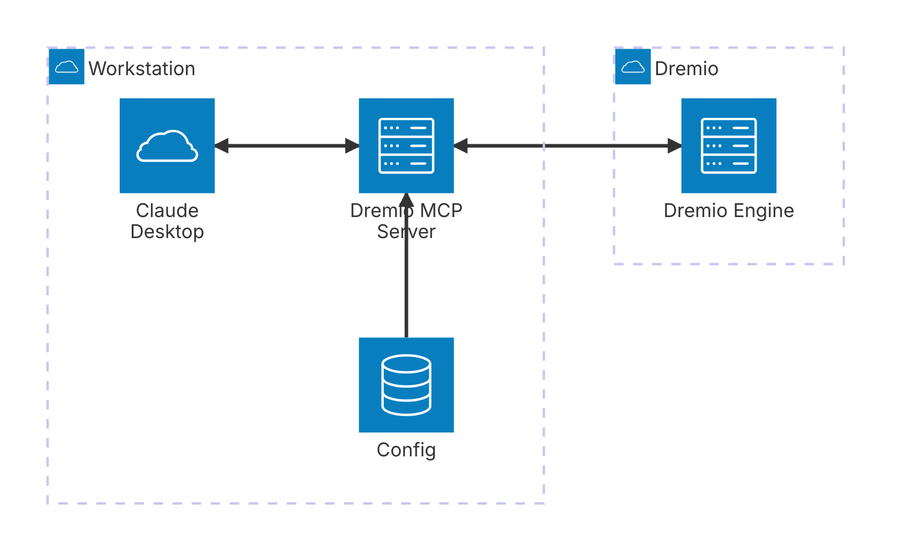

# Dremio MCP server

Table of Contents

-   [Introduction](#indroduction)
-   [Installation](#installation)
-   [Initial setup](#initial-setup)
    -   [MCP server config file](#mcp-server-config-file)
        -   [Format](#format)
        -   [Modes](#modes)
    -   [The LLM (Claude) config file](#the-llm-claude-config-file)
-   [Further Documentation](#further-documentation)
-   [Additional Information](#additional-information)

# Indroduction

-   [The dremio section contains 3 main things - the URI to connect, PAT to use]
    An **M**odel **C**ontext **P**rotocol ([MCP](https://docs.anthropic.com/en/docs/welcome)) server for easing LLM integration with Dremio.



# Installation

-   The MCP server is python based and the only prerequiste is to install the package manager [uv](https://docs.astral.sh/uv/guides/install-python/)
-   Do a sanity check by doing

```shell
# cd <toplevel git dir> or add `--directory <toplevel git dir>`
# to the command below

$ uv run dremio-mcp-server --help

 Usage: dremio-mcp-server [OPTIONS] COMMAND [ARGS]...

╭─ Options ────────────────────────────────────────────────────────────────────────╮
│ --install-completion            Install completion for the current shell.        │
│ --show-completion               Show completion for the current shell, to copy   │
│                                 it or customize the installation.                │
│ --help                -h        Show this message and exit.                      │
╰──────────────────────────────────────────────────────────────────────────────────╯
╭─ Commands ───────────────────────────────────────────────────────────────────────╮
│ run      Run the DremioAI MCP server                                             │
│ tools    Support for testing tools directly                                      │
│ config   Configuration management                                                │
╰──────────────────────────────────────────────────────────────────────────────────╯
```

# Initial setup

There are two configurations necessary before the MCP server can be invoked.

1. **The server config file**: This will cover the details of connecting and communicating with Dremio
2. **The LLM config file**: This covers configuring the LLM desktop app (Claude for now) to make it aware of the MCP server

## MCP server config file

This file is located by default at `$HOME/.config/dremioai/config.yaml` but can be overriden using the `--config-file` option at runtime for `dremio-mcp-server`

### Format

```yaml
# The dremio section contains 3 main things - the URI to connect, PAT to use
# and optionally the project_id if using with Dremio Cloud
dremio:
    uri: https://.... # the Dremio URI
    pat: "@~/ws/tokens/idl.token" # PAT can be put in a file and used here with @ prefix
    # optional
    # project_id: ....

tools:
    server_mode: FOR_DATA_PATTERNS # the serverm

# Optionally the MCP server can also connect and use a prometheus configuration if it
# has been enabled for your Dremio cluster (typically useful for SW installations)
#prometheus:
#uri: ...
#token: ...
```

### Modes

There are 3 modes

1. `FOR_DATA_PATTERNS` - the normal mode where MCP server will allow LLM to look at tables and data to allow pattern discovery and other use cases
2. `FOR_SELF` - a mode which allows the MCP server to introspect Dremio system, including workload analysis and so on.
3. `FOR_PROMETHEUS` - a mode that allow MCP server to connect to your prometheus setup, if one exists, to enhance insights with Dremio related metrics

Multiple modes can be specified with separated by `,`

## The LLM (Claude) config file

To setup the Claude config file (refer to [this as an example](https://modelcontextprotocol.io/quickstart/user#2-add-the-filesystem-mcp-server)) edit the Claude desktop config file

-   macOS: `~/Library/Application Support/Claude/claude_desktop_config.json`
-   Windows: `%APPDATA%\Claude\claude_desktop_config.json`

And then add this section

```json
{
  "globalShortcut": "",
  "mcpServers": {
    "Dremio": {
      "command": "uv",
      "args": [
        "run",
        "--directory", "<toplevel git directory>"
        "dremio-mcp-server",
        "run"
      ]
    }
  }
}
```

This will pickup the default location of MCP server config file. It can also be passed in the `args` section above as `"--config-file", "<custom config file>"` after `run`

# Further documentation

1. [Architecture](docs/architecture.md) : The details around Dremio MCP server architecture
2. Other frameworks : (Experimental) Integrate the same MCP tools with other agentic frameworks like LangChain or BeeAI without modifying the code base.

# Additional information

This repository is intended to be open source software that encourages conributions of any kind, like adding features, reporting issues and contributing fixes. This is not a part of Dremio product support.
