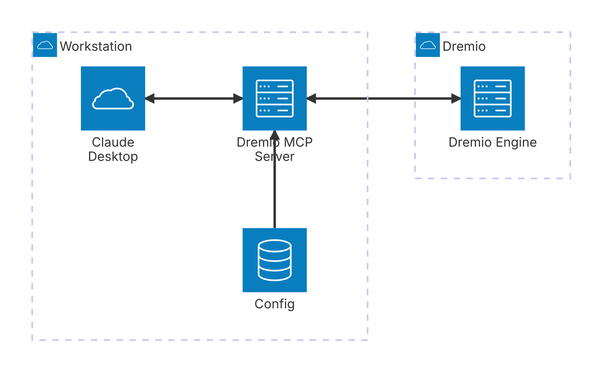

# Dremio MCP server

Table of Contents

- [Introduction](#introduction)
- [Installation](#installation)
- [Initial setup](#initial-setup)
  - [Quick start](#quick-start)
    - [Demo](#demo)
  - [Configuration details](#configuration-details)
    - [MCP server config file](#mcp-server-config-file)
       - [Format](#format)
       - [Modes](#modes)
    - [The LLM (Claude) config file](#the-llm-claude-config-file)
- [Further Documentation](#further-documentation)
- [Additional Information](#additional-information)

# Introduction

This repo provides an **M**odel **C**ontext **P**rotocol ([MCP](https://docs.anthropic.com/en/docs/welcome)) server for easing LLM integration with Dremio. If you are new to MCP and MCP Servers take our Dremio MCP Server course on Dremio University ([DremioU](https://university.dremio.com/course/dremio-mcp)). If you are familiar with these concepts already please proceed below.



# Installation

The MCP server runs locally on the machine that runs the LLM frontend (eg Claude). The installation steps are simple

1. Clone or download this repository.
2. Install the [uv](https://docs.astral.sh/uv/guides/install-python/) package manager (note that the MCP server requires python 3.11 or later)
3. Do a sanity check by running the command and validating the output as shown below.

```shell
# cd <toplevel git dir> or add `--directory <toplevel git dir>`
# to the command below

$ uv run dremio-mcp-server --help

 Usage: dremio-mcp-server [OPTIONS] COMMAND [ARGS]...

╭─ Options ────────────────────────────────────────────────────────────────────────╮
│ --install-completion            Install completion for the current shell.        │
│ --show-completion               Show completion for the current shell, to copy   │
│                                 it or customize the installation.                │
│ --help                -h        Show this message and exit.                      │
╰──────────────────────────────────────────────────────────────────────────────────╯
╭─ Commands ───────────────────────────────────────────────────────────────────────╮
│ run      Run the DremioAI MCP server                                             │
│ tools    Support for testing tools directly                                      │
│ config   Configuration management                                                │
╰──────────────────────────────────────────────────────────────────────────────────╯
```

# Initial setup

There are two configurations necessary before the MCP server can be invoked.

1. **The server config file**: This will cover the details of connecting and communicating with Dremio
2. **The LLM config file**: This covers configuring the LLM desktop app (Claude for now) to make it aware of the MCP server

## Quick start

The quickest way to do this setup is -

1. Create the dremio config file as outlined below and be prepared with these values

```shell
$ uv run dremio-mcp-server config create dremioai \
    --uri <dremio uri> \
    # the endpoint portion of the URL for your environment
    --pat <dremio pat> \
    # https://docs.dremio.com/current/security/authentication/personal-access-tokens/#using-a-pat
    # required for cloud: add your project ID if setting up for dremio cloud
    # --project-id <dremio project id>
```

Note: the uri is api endpoint associated with your environment:

- For Dremio cloud based in the US region (https://app.dremio.cloud)	use `https://api.dremio.cloud` or use the short hand `prod`
- For Dremio cloud based in the EMEA region (https://app.eu.dremio.cloud)	use `https://api.eu.dremio.cloud` or use the short hand `prodemea`
- For SW/K8S deployments use https://<coordinator‑host>:<9047 or custom port>

Note: For security purposes, if you don't want the PAT to leak into your shell history file, create a file with your PAT in it and give it as an argument to the dremio config. 

Example: 

```shell
$ uv run dremio-mcp-server config create dremioai \
    --uri <dremio uri> \
    --pat @/path/to/tokenfile \
```

2. Download and install Claude Desktop ([Claude](https://claude.ai/download))

Note: Claude has system requirements, such as node.js, please validate your system requirements with Claude official documentation. 

3. Create the Claude config file using

```shell
$ uv run dremio-mcp-server config create claude
```

4. Validate the config files using

```shell
$ uv run dremio-mcp-server config list --type claude

Default config file: '/Users/..../Library/Application Support/Claude/claude_desktop_config.json' (exists = True)
{
    'globalShortcut': '',
    'mcpServers': {
        'Dremio': {
            'command': '/opt/homebrew/Cellar/uv/0.6.14/bin/uv',
            'args': [
                'run',
                '--directory',
                '...../dremio-mcp',
                'dremio-mcp-server',
                'run'
            ]
        }
    }
}

$ uv run dremio-mcp-server config list --type claude
Default config file: /Users/..../.config/dremioai/config.yaml (exists = True)
dremio:
  enable_experimental: false
  pat: ....
  uri: ....
tools:
  server_mode: FOR_DATA_PATTERNS
```

**You are done!**. You can start Claude and start using the MCP server

### Demo


The rest of the documentation below provides details of the config files

## Configuration details

### MCP server config file

This file is located by default at `$HOME/.config/dremioai/config.yaml` but can be overriden using the `--config-file` option at runtime for `dremio-mcp-server`

#### Format

```yaml
# The dremio section contains 3 main things - the URI to connect, PAT to use
# and optionally the project_id if using with Dremio Cloud
dremio:
    uri: https://.... # the Dremio URI
    pat: "@~/ws/tokens/idl.token" # PAT can be put in a file and used here with @ prefix
    project_id: <string> Project ID required for Dremio Cloud
    enable_experimental: <bool> # Optional: Enable experimental features
    allow_dml: <bool> # Optional: Allow MCP Server to create views in Dremio
tools:
    server_mode: FOR_DATA_PATTERNS # the serverm

# Optionally the MCP server can also connect and use a prometheus configuration if it
# has been enabled for your Dremio cluster (typically useful for SW installations)
#prometheus:
#uri: ...
#token: ...
```

#### Modes

There are 3 modes

1. `FOR_DATA_PATTERNS` - the normal mode where MCP server will allow LLM to look at tables and data to allow pattern discovery and other use cases
2. `FOR_SELF` - a mode which allows the MCP server to introspect Dremio system, including workload analysis and so on.
3. `FOR_PROMETHEUS` - a mode that allow MCP server to connect to your prometheus setup, if one exists, to enhance insights with Dremio related metrics

Multiple modes can be specified with separated by `,`

### The LLM (Claude) config file

To setup the Claude config file (refer to [this as an example](https://modelcontextprotocol.io/quickstart/user#2-add-the-filesystem-mcp-server)) edit the Claude desktop config file

-   macOS: `~/Library/Application Support/Claude/claude_desktop_config.json`
-   Windows: `%APPDATA%\Claude\claude_desktop_config.json`

And then add this section

```json
{
  "globalShortcut": "",
  "mcpServers": {
    "Dremio": {
      "command": "uv",
      "args": [
        "run",
        "--directory", "<toplevel git directory>"
        "dremio-mcp-server",
        "run"
      ]
    }
  }
}
```

This will pickup the default location of MCP server config file. It can also be passed in the `args` section above as `"--config-file", "<custom config file>"` after `run`

# Further Documentation

1. [Architecture](docs/architecture.md): Detailed overview of the Dremio MCP server architecture, including component interactions and data flows.

2. [Tools](docs/tools.md): Comprehensive guide to available tools, including:

    - Tool categories and types
    - Usage examples
    - Development guidelines
    - Integration support

3. [Settings](docs/settings.md): Complete configuration reference covering:

    - Dremio connection settings
    - Tool configurations
    - Framework integrations
    - Environment variables

4. Other frameworks: (Experimental) Integrate the same MCP tools with other agentic frameworks like LangChain or BeeAI without modifying the code base.

# Additional Information

This repository is intended to be open source software that encourages contributions of any kind, like adding features, reporting issues and contributing fixes. This is not a part of Dremio product support.

## Testing

The project uses pytest for testing. To run the tests:

```shell
# Run all tests
$ uv run pytest tests

```

GitHub Actions automatically runs tests on pull requests and pushes to the main branch.

## Contributing

Please see our [Contributing Guide](CONTRIBUTING.md) for details on:

-   Setting up your development environment
-   Making contributions
-   Code style guidelines
-   Documentation requirements
-   Running tests
