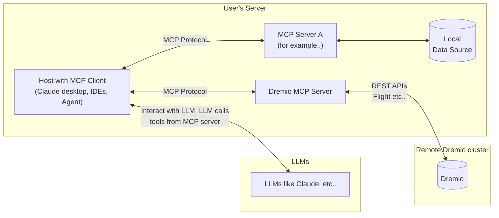
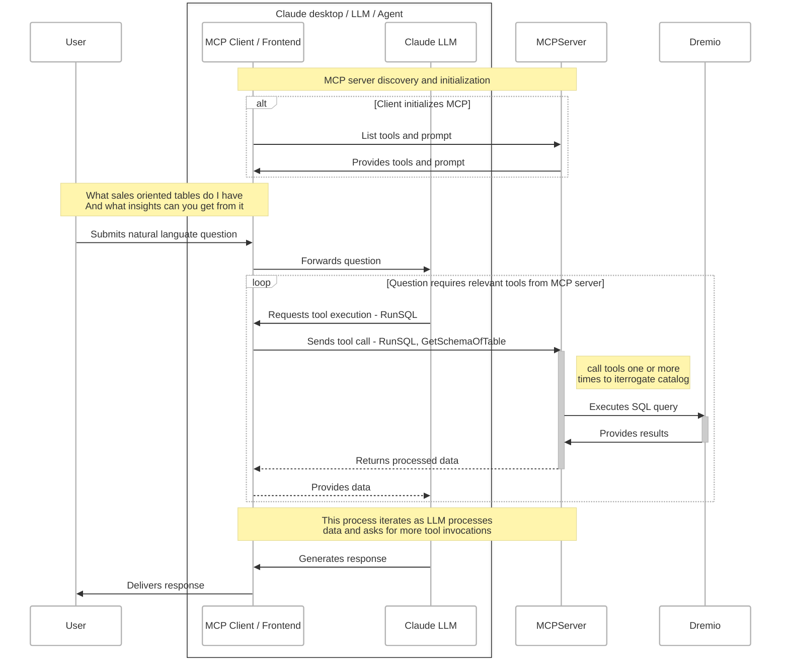

# Dremio MCP Server architecture

## High level

```mermaid
flowchart LR
    subgraph "LLMs"
        LLM["LLMs like Claude, etc.."]
    end
    subgraph "User's Server"
        Host["Host with MCP Client<br/>(Claude desktop, IDEs, Agent)"]
        S1["MCP Server A<br/>(for example..)"]
        S2["Dremio MCP Server"]
        Host <-->|"MCP Protocol"| S1
        Host <-->|"MCP Protocol"| S2
        Host <-->|"Interact with LLM. LLM calls<br/>tools from MCP server"| LLM
        S1 <--> D1[("Local<br/>Data Source")]
    end
    subgraph "Remote Dremio cluster"
        S2 <-->|"REST APIs<br/>Flight etc.."| D3[("Dremio")]
    end
```

## How does it work

```mermaid
---
config:
  look: handDrawn
  theme: neo
---


sequenceDiagram
    participant User

    box Claude desktop / LLM / Agent
    participant Client as MCP Client / Frontend
    participant LLM as Claude LLM
    end

    participant MCP as MCPServer
    participant DB as Dremio

    Note over Client,MCP: MCP server discovery and initialization
    alt Client initializes MCP
        Client->>MCP: List tools and prompt
        MCP->>Client: Provides tools and prompt
    end


    Note over User,Client: What sales oriented tables do I have<br/>And what insights can you get from it
    User->>Client: Submits natural languate question
    Client->>LLM: Forwards question

    loop Question requires relevant tools from MCP server
        LLM->>Client: Requests tool execution -  RunSQL
        Client->>MCP: Sends tool call - RunSQL, GetSchemaOfTable
        activate MCP
        Note right of MCP: call tools one or more <br/> times to iterrogate catalog
        MCP->>DB: Executes SQL query
        activate DB
        DB->>MCP: Provides results
        deactivate DB
        MCP-->>Client: Returns processed data
        deactivate MCP
        Client-->>LLM: Provides data
    end
    Note over Client,MCP: This process iterates as LLM processes<br/> data and asks for more tool invocations

    LLM->>Client: Generates response
    Client->>User: Delivers response
```
