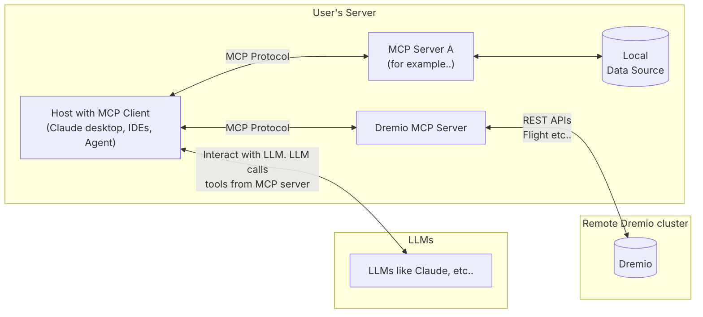
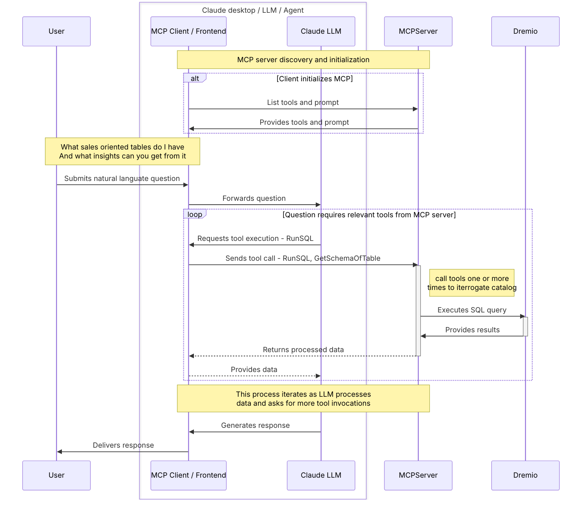
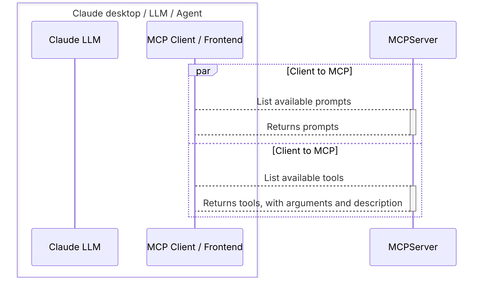

# Dremio MCP Server Architecture

## High Level Overview

The Dremio MCP Server implements the [Model Context Protocol (MCP)](https://modelcontextprotocol.io/introduction) to create a standardized interface between Large Language Models (LLMs) and Dremio data platform. This architecture enables seamless integration between LLMs and Dremio's capabilities, allowing for natural language interactions with data and analytics workflows.

### What is MCP?

At a glance, the MCP based architecture looks like this: 

The architecture consists of three main components:

1. **LLM Layer**:

    - Handles natural language understanding and generation
    - Makes intelligent decisions about which tools to use
    - Processes results and generates human-readable responses

2. **MCP Client/Host**:

    - Provides the user interface (Claude desktop, IDEs, or other agents)
    - Manages communication between LLMs and MCP servers
    - Handles tool discovery and execution

3. **MCP Servers**:
    - Dremio MCP Server: Provides specialized tools for Dremio interaction
    - Other MCP Servers: Can run alongside Dremio MCP server for additional capabilities
    - Each server exposes a standardized interface through the MCP protocol

## Interaction Flow

The following diagram illustrates the detailed interaction flow between components:

### Interaction Steps:

1. **Initialization Phase**:

    - MCP Client discovers available MCP servers
    - Each server provides its capabilities (tools) and prompts
    - System establishes connections and validates access

2. **Query Processing**:

    - User submits natural language questions
    - LLM analyzes the question and determines required tools
    - Tools are executed through the MCP protocol
    - Results are processed and returned to the user

3. **Iterative Processing**:
    - LLM may make multiple tool calls to gather complete information
    - Each tool call is handled independently
    - Results are accumulated and synthesized into final response

## Tool Discovery and Initialization

The following diagram shows how tools are discovered and initialized:

### Tool Discovery Process:

1. **Prompt Discovery**:

    - Client requests available prompts from MCP server
    - Server returns specialized prompts for different use cases
    - Prompts are cached for future use

2. **Tool Discovery**:
    - Client requests available tools from MCP server
    - Server returns tool definitions including:
        - Tool names and descriptions
        - Required arguments and types
        - Expected return values
    - Tools are registered with the LLM for use

This architecture enables flexible and extensible integration between LLMs and Dremio, allowing for natural language interaction with data while maintaining security and control through the MCP protocol.
